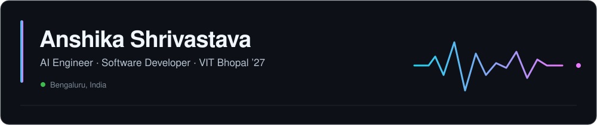

<p align="center">
  
</p>

<p align="center">
  <a href="https://www.linkedin.com/in/anshika-shrivastava-a2a078294/">LinkedIn</a> •
  <a href="mailto:anshikashrivastava2012@gmail.com">Email</a> •
  <a href="https://github.com/ANSHIKA1220/Resume">Résumé</a>
</p>

I’m an AI systems engineer and B.Tech CSE (AI & ML) student at VIT Bhopal with a **9.4 CGPA**. I build agentic, retrieval and multimodal systems that transform unstructured documents, images and operational data into grounded, explainable decisions.


## Selected evidence files

### `CASE-01` · LawBridge — Multi-Agent Legal AI

Coordinated **five specialized agents** through semantic routing, tool selection and domain-specific workflows. Combined OCR, NLP and RAG for grounded legal responses, with FastAPI/WebSocket services and role-based review dashboards.

`Python` `FastAPI` `React` `Next.js` `OpenClaw` `RAG` `OCR` `WebSockets`

### `CASE-02` · UBID — Probabilistic Entity Resolution

Built a Splink/Fellegi-Sunter linkage pipeline with candidate blocking and union-find clustering across departmental datasets. Evaluation against synthetic ground truth achieved **100% precision, 89.3% recall and 94.3% F1**.

`Python` `Splink` `DuckDB` `FastAPI` `React` `Ollama`

### `CASE-03` · NeuroVision — Multimodal Medical AI

Combined MONAI 3D U-Net segmentation with BLIP visual question answering for MRI analysis. Used LoRA, mixed precision, DVC and MLflow for training and experiment tracking, with LangGraph retrieval and an interactive inference interface.

`PyTorch` `MONAI` `BLIP` `LangGraph` `DVC` `MLflow` `FastAPI`


```

## Technical trace

**Languages:** `Python` `JavaScript` `Java` `SQL`  
**AI Engineering:** `LLM Agents` `RAG` `Embeddings` `Vector Search` `Tool Calling` `LoRA`  
**Frameworks:** `FastAPI` `Flask` `React` `Next.js` `LangGraph` `PyTorch` `Transformers`  
**Data & Tools:** `PostgreSQL` `MySQL` `DuckDB` `ChromaDB` `Docker` `DVC` `MLflow` `Ollama`

## Verified milestones

- **2nd Runner-Up — Epsilon TeXpedition 2026:** Top 10 finalist from 600+ registrations for developing [JourneySync AI](https://github.com/ANSHIKA1220/JustSync-AI).
- **9th Place — Health Hack 2025:** Ranked 9th among 267 teams for developing NeuroVision.
- Completed the ServiceNow University Virtual Internship Program and Applied Machine Learning in Python from the University of Michigan.

## Live contribution forensics

<p align="center">
  
</p>

<sub>Automatically regenerated from real GitHub contribution data.</sub>
